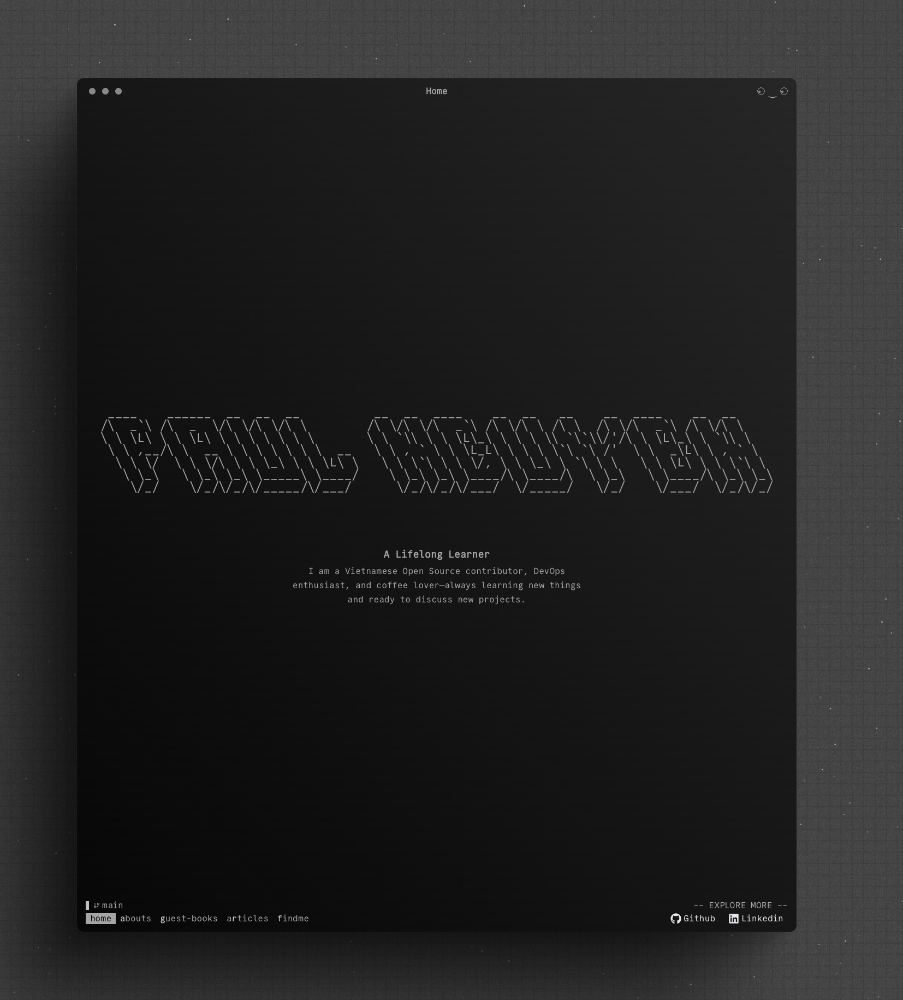

# Hieu Nguyen's Homepage & Portfolio 

A premium, interactive personal website, blog, and portfolio built with SvelteKit and Svelte 5, featuring a retro-futuristic macOS-like desktop layout.

## Preview



---

## The Stack

This application is built with modern, cutting-edge web technologies:

*   **Frontend Framework**: [Svelte 5](https://svelte.dev/) (leveraging the new Runes reactivity system) & [SvelteKit 2](https://kit.svelte.dev/) for server rendering and routing.
*   **Styling**: [Tailwind CSS v4](https://tailwindcss.com) (integrated via `@tailwindcss/vite` for blazing-fast builds).
*   **Database ORM**: [Drizzle ORM](https://orm.drizzle.team/) connecting to PostgreSQL with `postgres.js`.
*   **Authentication**: Custom session management inspired by Lucia Auth, powered by [Arctic](https://arctic.js.org/) for GitHub OAuth.
*   **Content Management**: Markdown preprocessor via [mdsvex](https://mdsvex.pngwn.io/) for writing blogs, projects, and bio sections.
*   **Syntax Highlighting**: Powered by [Shiki](https://shiki.style/) for pixel-perfect code blocks in markdown pages.
*   **Interactivity**: Integrated [Mapbox GL JS](https://www.mapbox.com/) for location maps and web haptics for responsive mobile feedback.

---

## Key Features

1.  **Interactive Desktop Interface**: The entire layout is structured inside a draggable, resizable, double-clickable window resembling a classic operating system interface (configured in [+layout.svelte](file:///Users/songhanpoo/Desktop/DEV/Nextjs/site/src/routes/+layout.svelte)).
2.  **Noise & Particle Effects**: Includes a retro-looking canvas particle background system and a grain filter noise overlay to provide rich visual aesthetics.
3.  **Dynamic Blogs & Projects**: High-quality markdown blogs and projects parsed dynamically using mdsvex with remark-toc and rehype-slug for automatic table of contents generation.
4.  **GitHub-authenticated Guestbook**: A persistent, real-time-like guestbook page where users sign in with their GitHub account and leave messages.
5.  **Interactive Locator Map**: The "Find Me" page integrates Mapbox GL to show the current location coordinates with customized map styles.

---

## 🚀 Running Locally

Follow these steps to get a local development environment running:

### 1. Clone the repository
```bash
git clone https://github.com/songhanpoo/site
cd site
```

### 2. Configure environment variables
Create a `.env` file from the provided [.env.example](file:///Users/songhanpoo/Desktop/DEV/Nextjs/site/.env.example):
```bash
cp .env.example .env
```
Open `.env` and fill in the required values:
*   `DATABASE_URL`: Your primary PostgreSQL database URL.
*   `DIRECT_URL`: Database connection URL bypasses poolers, used for running migrations.
*   `GITHUB_CLIENT_ID` / `GITHUB_CLIENT_SECRET`: Credentials from a registered GitHub OAuth App.
*   `BASE_URL`: Base URL (e.g. `http://localhost:5173`) used for building redirects.
*   `PUBLIC_MAPBOX_ACCESS_TOKEN`: Mapbox API token.

### 3. Install dependencies
Ensure you have `pnpm` installed:
```bash
pnpm install
```

### 4. Database Setup & Migrations
This project uses [drizzle.config.ts](file:///Users/songhanpoo/Desktop/DEV/Nextjs/site/drizzle.config.ts) to manage the schema defined in [schema.ts](file:///Users/songhanpoo/Desktop/DEV/Nextjs/site/src/lib/server/db/schema.ts).

Generate and push the schema schema:
```bash
# Push schema directly to the database
pnpm db:push

# Or generate and run migrations
pnpm db:generate
pnpm db:migrate
```

You can inspect the database locally using Drizzle Studio:
```bash
pnpm db:studio
```

### 5. Run the dev server
```bash
pnpm dev
```
Open `http://localhost:5173` in your browser.

---

## Project Structure

Key directories and configuration files:
*   [src/routes/](file:///Users/songhanpoo/Desktop/DEV/Nextjs/site/src/routes): SvelteKit app router (pages, APIs, layouts).
*   [src/lib/server/db/](file:///Users/songhanpoo/Desktop/DEV/Nextjs/site/src/lib/server/db): Database schemas and clients.
*   [src/contents/](file:///Users/songhanpoo/Desktop/DEV/Nextjs/site/src/contents): Markdown data source files for articles, projects, and personal details.
*   [package.json](file:///Users/songhanpoo/Desktop/DEV/Nextjs/site/package.json): Dev dependencies, scripts, and runtime packages.

---

## License

1. You are free to use this code as inspiration.
2. Please do not copy it directly.
3. Crediting the author is appreciated.
